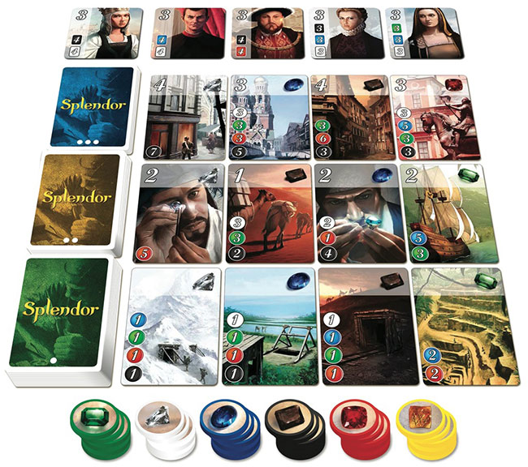
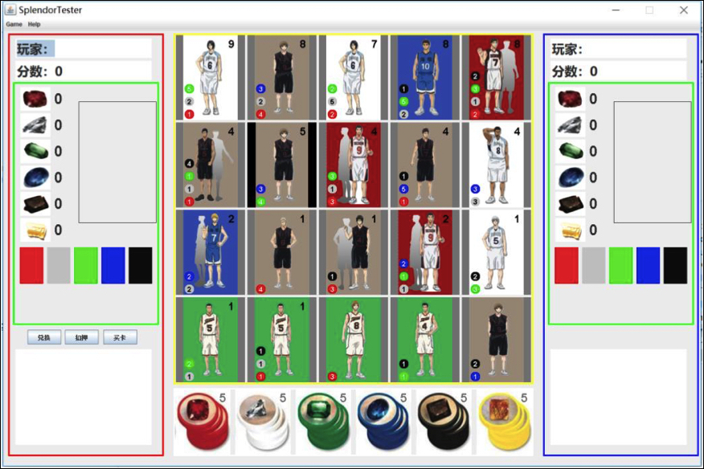
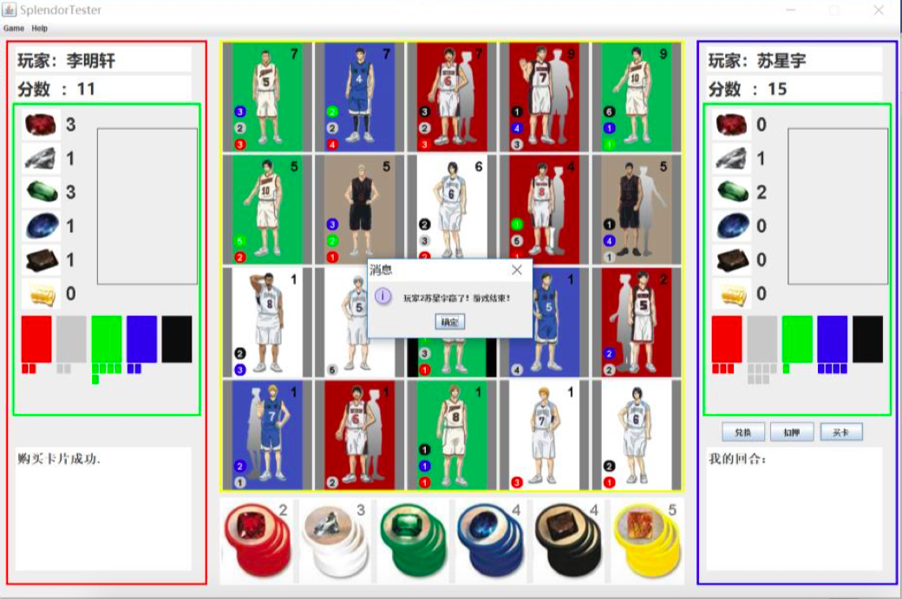
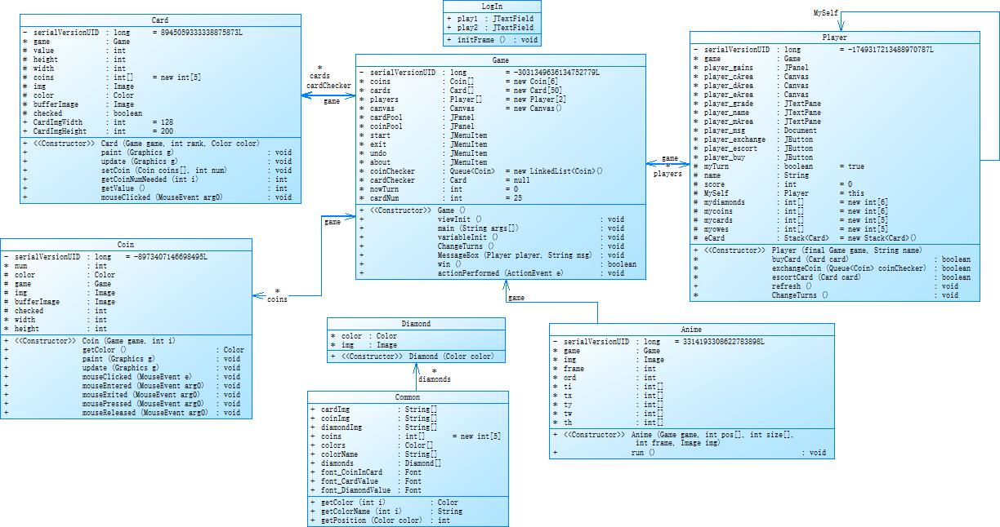

Splendor <a name="Title"> </a>
=======
李明轩 2015010705 [limx15@mails.tsinghua.edu.cn](limx15@mails.tsinghua.edu.cn)
苏星宇 2015010697 [suxy15@mails.tsinghua.edu.cn](suxy15@mails.tsinghua.edu.cn)

### 游戏说明



+ Splender 是一个多人游戏。该游戏分为三个“元素”：最上方的五张“贵族牌”、中间三排“发展卡”、最下方的六种“宝石币”。玩家每回合可执行以下的操作之一：

  1. 得到三个颜色各异的“宝石币”，或两个颜色相同的“宝石币”。（金色宝石币除外）
  2. 用“发展卡”左方显示的相应宝石数量去换取自己想要的“发展卡”（比如用两个蓝色和两个红色宝石去换取右下角的“发展卡”），将用掉的“宝石”放回宝石堆里。
  3. 得到一个金色的宝石，并从已显示的“发展卡”堆中任意取来一个自己心仪的“发展卡”，将其翻面，等以后自己有足够的宝石数量时再将其兑换（翻回正面，作为自己的牌使用）
  4. 兑换自己手中的翻面状态的“发展牌”。

+ 使用 `Java awt` 和 `Java swing` 实现界面如下：

  

  

### 文档

+ 类图



+ [选题与需求分析报告](doc/选题与需求分析报告.pdf)
+ [设计说明书](doc/设计说明书.pdf)
+ [测试报告](doc/测试报告.pdf)
+ [用户手册](doc/用户手册.pdf)

+ 代码结构

  ```bash
       160 SplendorTester/src/app/GameViewTester.java
        74 SplendorTester/src/app/GameWindowTester.java
        74 SplendorTester/src/app/ImgTester.java
        43 SplendorTester/src/app/LayerTester.java
        49 SplendorTester/src/model/Anime.java
       144 SplendorTester/src/model/Card.java
       175 SplendorTester/src/model/Coin.java
        71 SplendorTester/src/model/Common.java
        23 SplendorTester/src/model/Diamond.java
       190 SplendorTester/src/model/Game.java
        62 SplendorTester/src/model/LogIn.java
       357 SplendorTester/src/model/Player.java
       107 SplendorTester/src/model/classDiagram.mgc
      1529 total
  ```

  